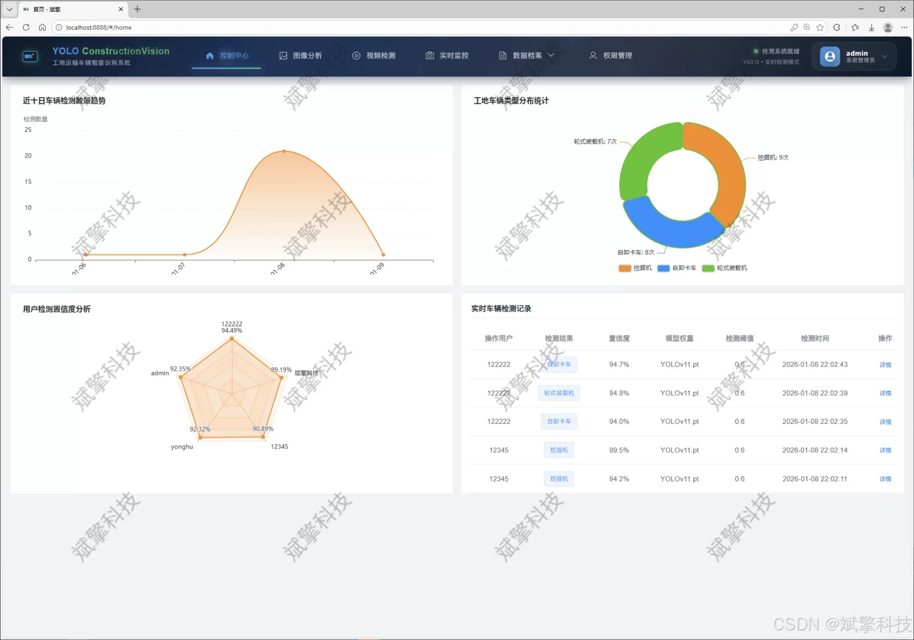
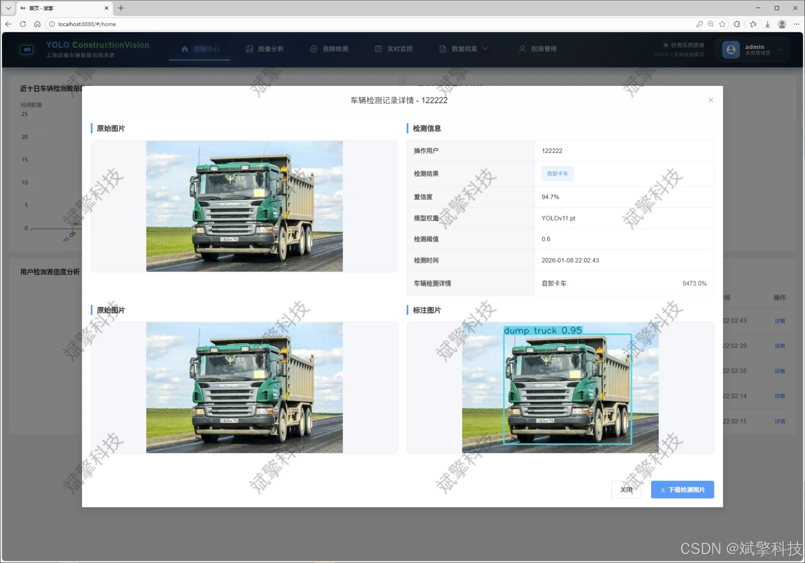
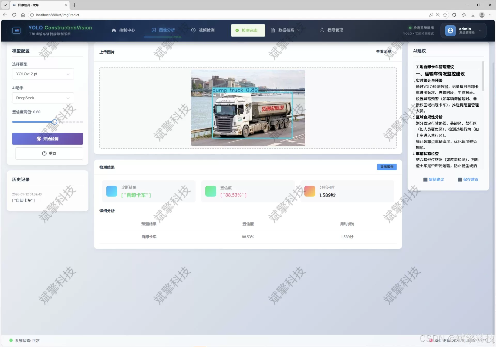
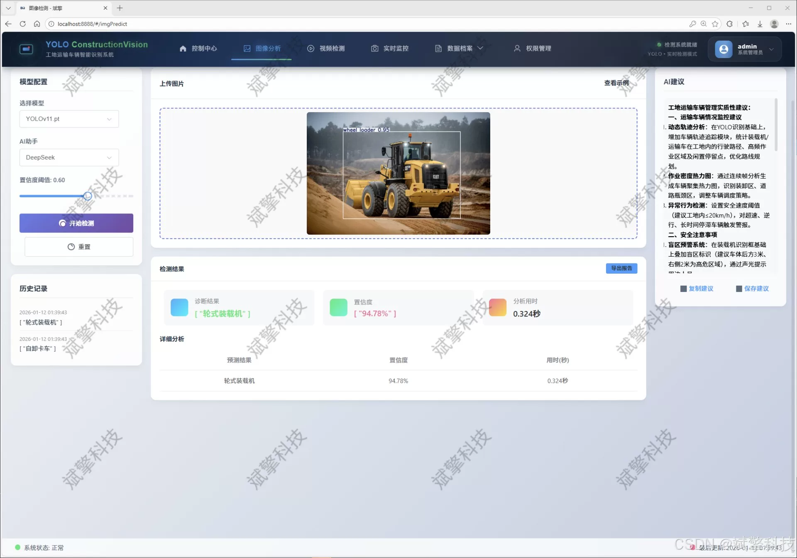
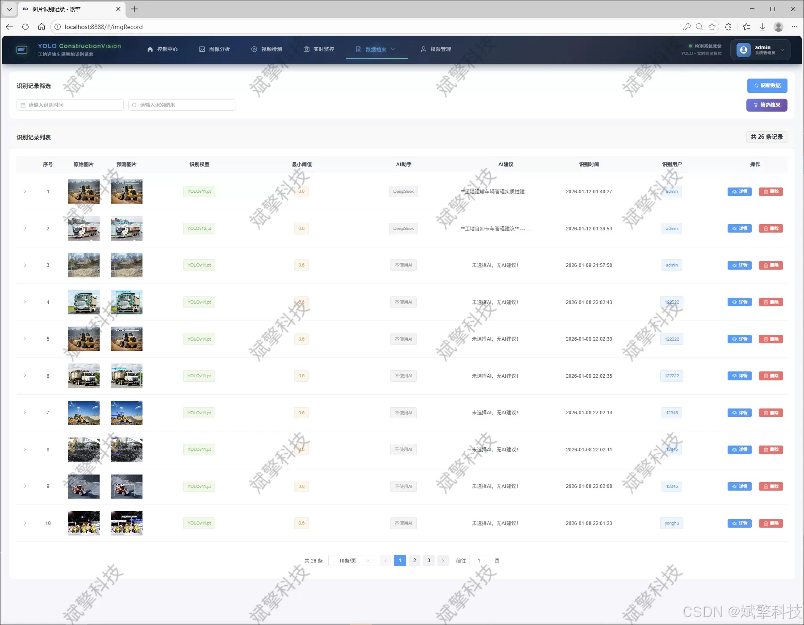
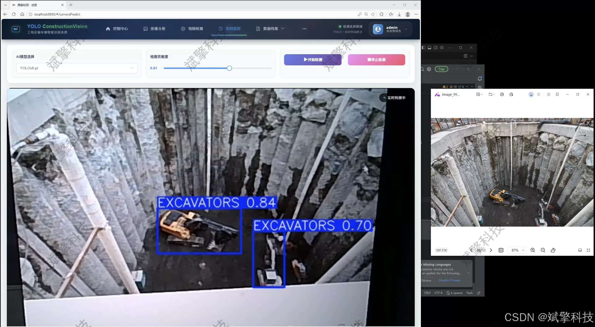
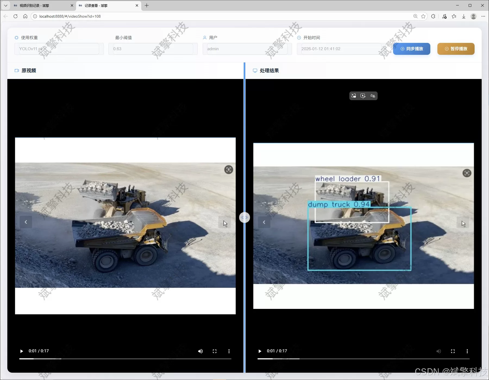
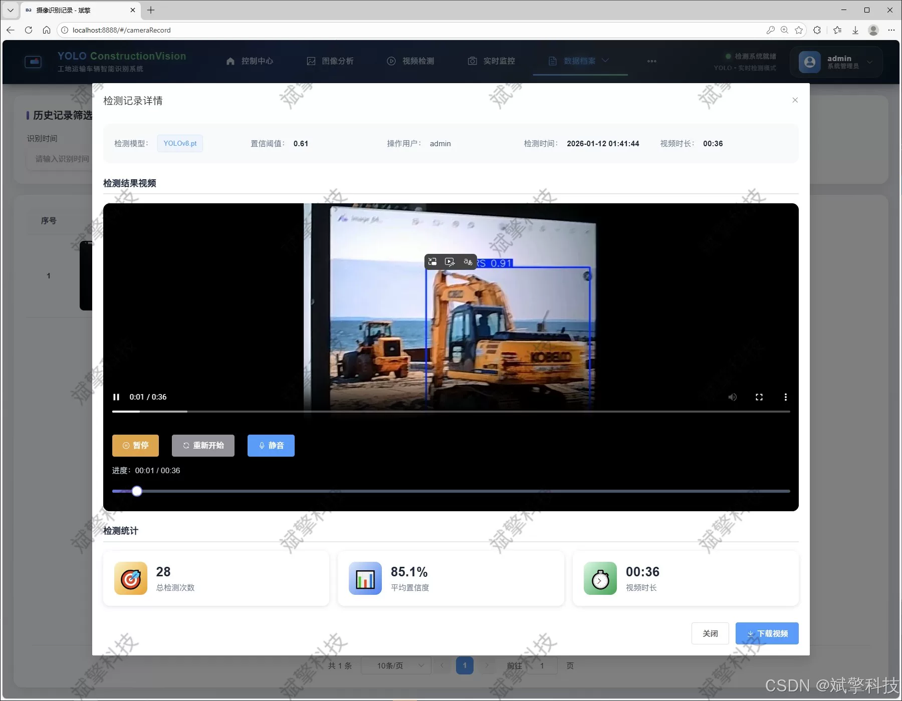

# YOLO+DeepSeek construction vehicle inspection system

## Body

The YOLO+DeepSeek construction vehicle inspection system is based on the YOLO deep learning and the large models of Qianwen and DeepSeek. The system can detect the types of construction vehicles (DeepSeek intelligent analysis + web interaction interface + front-end and back-end separation + YOLO data + YOLOv8/YOLOv10/YOLOv11/YOLOv12).

As our country's urbanization process accelerates and infrastructure construction flourishes, the management of various large-scale construction sites has become increasingly complex and refined. The efficient and safe management of internal transportation vehicles (such as excavators, dump trucks, wheel loaders) is a key to ensuring construction progress, preventing safety accidents, and optimizing resource allocation. Traditional manual inspection and monitoring methods are inefficient, lack real-time capability, and are prone to missed or incorrect judgments, failing to meet the needs of modern smart construction site management.

This project aims to design and implement a "Smart Construction Site Transport Vehicle Type Intelligent Detection and Management System" that integrates cutting-edge deep learning object detection technology, modern Web development architecture, and intelligent analysis functions. The core of this system utilizes the current state-of-the-art and continuously evolving YOLO series models (including YOLOv8, YOLOv10, YOLOv11, and YOLOv12), creating a high-precision, real-time computation vehicle detection engine. Through the SpringBoot back-end framework and front-end separation technology, a stable, scalable, and user-friendly interactive Web management platform is constructed.
The system deeply integrates the intelligence analysis capabilities of the DeepSeek large language model, not only achieving multimodal target detection for images, video streams, and camera real-time footage but also capable of contextual understanding and semantic description of detection results, significantly enhancing the level of decision-making intelligence. The system features comprehensive user permission management, structured storage of massive detection data (based on MySQL), multidimensional visualization statistical analysis, and full-process record traceability.
Testing has shown that the system achieves a relatively high average detection accuracy (mAP) for three typical types of construction site transportation vehicles: excavators, dump trucks, and wheel loaders, effectively serving practical scenarios such as vehicle dispatch, safety monitoring, and operational statistics. It provides strong technical tools and solutions for the digital transformation and intelligent upgrade of construction sites.

Functional module

✅ User Login and Registration: Supports password detection, saves to MySQL database.

✅ Supports four YOLO model switches, YOLOv8, YOLOv10, YOLOv11, YOLOv12.

✅ Information Visualization, Data Visualization.

✅ Image detection supports AI analysis functions, deepseek and Qianwen.

✅ Supports image detection, video detection, and real-time camera detection. The results are saved to a MySQL database.

✅ Picture recognition record management, video recognition record management and camera recognition record management.

✅ User Management Module, administrators can add, delete, modify, and query users.

✅ Personal center, can modify their own information, password name profile picture and so on.

There is no Lunwen writing service, nor any Lunwen.

## Images

## Payment

Here is a pay link on Stripe ( https://buy.stripe.com/3cs8yP7sY87d0vu9AB ). Please contact me lonlonago@foxmail.com after funding $89, and I will send you a complete data files , thank you!

